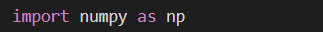

# DIABETES-PREDICTION-USING-MACHINE-LEARNING
Diabetes\_Prediction

-----
The aim of this project is to predict whether a person is diabetic or not using a dataset from kaggle using machine learning.

Libraries used:-

-----
- **Numpy**

**Importing Numpy Library**

**About Numpy**

Numpy is a library for the Python programming language, adding support for large, multi-dimensional arrays and matrices, along with a large collection of high-level mathematical functions to operate on these arrays.

- **Pandas**

**Importing Pandas Library**

**About Pandas**

Pandas is a Python package providing fast, flexible, and expressive data structures designed to make working with “relational” or “labeled” data both easy and intuitive. It aims to be the fundamental high-level building block for doing practical, real-world data analysis in Python.

- **Sklearn**

**Importing Sklearn**

**About Sklearn**

Scikit-learn (Sklearn) is the most useful and robust library for machine learning in Python. It provides a selection of efficient tools for machine learning and statistical modeling including classification, regression, clustering and dimensionality reduction via a consistent interface in Python. This library, which is largely written in Python, is built upon NumPy, SciPy and Matplotlib.

**Different functions imported from Sklearn:-**

- **StandardScaler()-** Python Sklearn library offers us with StandardScaler() function to standardize the data values into a standard format. It removes the mean and scales each feature/variable to unit variance.
- **train\_test\_split-** Using [train_test_split()](https://scikit-learn.org/stable/modules/generated/sklearn.model_selection.train_test_split.html) from the data science library [scikit-learn](https://scikit-learn.org/stable/index.html), you can split your dataset into subsets that minimize the potential for bias in your evaluation and validation process.
- **svm-** Support vector machines (SVMs) are a set of supervised learning methods used for classification, regression and outliers detection. It is used in applications like handwriting recognition, intrusion detection, face detection, email classification, gene classification, and in web pages.
- **accuracy\_score-** This function computes subset accuracy: the set of labels predicted for a sample must exactly match the corresponding set of labels in y\_true.

Data Analysis

-----
- Based on the number of pregnancies

- Based on various health related factors

Model Analysis

-----
- With an accuracy score of 78.66% on training data and an accuracy of 77.27% on test data, our model will predict whether you are diabetic or not.

Know Diabetes, Fight Diabetes-----

